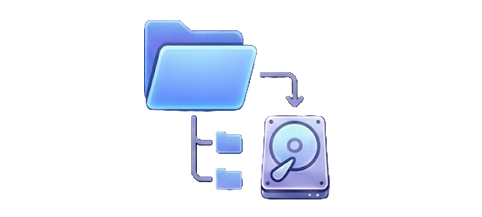
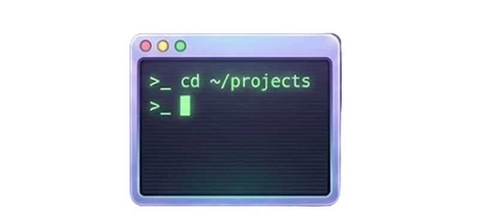
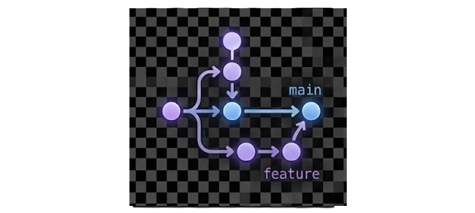

```{=html}
<div class="refresh-hero">
  <div class="hero-content">
    <div class="hero-title-group">
      <h1>Know Your Damned Computer</h1>
      <p class="subtitle">
        Bridging the gap between traditional humanities and modern computing.

      </p>
    </div>

    <div class="hero-actions">
      <a href="#guides" class="btn-pill primary">
        <i class="fas fa-terminal"></i> Start Learning
      </a>
      <a href="about.qmd" class="btn-pill secondary">
        <i class="fas fa-book-open"></i> Read Manifesto
      </a>
    </div>

    <div class="stats-bar">
      <div class="stat-item">
        <span class="value">9</span>
        <span class="label">Modules</span>
      </div>
      <div class="stat-item">
        <span class="value">20+</span>
        <span class="label">Exercises</span>
      </div>
      <div class="stat-item">
        <span class="value">100%</span>
        <span class="label">Open Source</span>
      </div>
    </div>
  </div>
</div>

<section id="guides">
  <h2 class="section-title">Interactive Learning Guides</h2>
  
  <h3 class="section-subtitle">Getting Started</h3>
  <div class="bento-grid">
    <!-- Environment Setup -->
    <a href="guides/environment-setup.qmd" class="bento-card">
      <div class="card-content">
        <h3>Environment Setup</h3>
        <p>Install Python, VS Code, and Git. Configure your terminal. Verify everything works. Do this first — every other guide assumes it's done.</p>
        <div class="card-meta">
          <span class="chip">Beginner</span>
          <span class="chip">Start Here</span>
        </div>
      </div>
    </a>
  </div>

  <h3 class="section-subtitle">Fundamentals</h3>
  <div class="bento-grid">
    <!-- File Management -->
    <a href="guides/file-management.qmd" class="bento-card">
      
      <div class="card-content">
        <h3>File Management</h3>
        <p>Stop losing your thesis. Naming conventions, folder structures, backup strategies, and cloud storage — organize your digital life.</p>
        <div class="card-meta">
          <span class="chip">Beginner</span>
          <span class="chip">macOS/Win</span>
        </div>
      </div>
    </a>

    <!-- File Paths -->
    <a href="guides/file-paths.qmd" class="bento-card">
      
      <div class="card-content">
        <h3>File Paths</h3>
        <p>Navigate your file system with precision. Understand absolute vs. relative paths and never get "File Not Found" again.</p>
        <div class="card-meta">
          <span class="chip">Beginner</span>
          <span class="chip">Core Concept</span>
        </div>
      </div>
    </a>

    <!-- Compression -->
    <a href="guides/compression.qmd" class="bento-card">
      
      <div class="card-content">
        <h3>Compression</h3>
        <p>Zip, Tar, Gzip? Learn how file compression works, why it matters, and how to archive your research data.</p>
        <div class="card-meta">
          <span class="chip">Beginner</span>
          <span class="chip">Utilities</span>
        </div>
      </div>
    </a>

    <!-- File Formats -->
    <a href="guides/file-formats.qmd" class="bento-card">
      <div class="card-content">
        <h3>File Formats</h3>
        <p>From DOCX to PDF to Markdown. Understanding file extensions, choosing the right format for Python analysis.</p>
        <div class="card-meta">
          <span class="chip">Beginner</span>
          <span class="chip">Concepts</span>
        </div>
      </div>
    </a>
  </div>

  <h3 class="section-subtitle">Tools & Techniques</h3>
  <div class="bento-grid">
    <!-- Command Line -->
    <a href="guides/command-line.qmd" class="bento-card">
      
      <div class="card-content">
        <h3>Command Line</h3>
        <p>Unlock the true power of your computer. Navigate directories, install packages, manage virtual environments, and run scripts.</p>
        <div class="card-meta">
          <span class="chip">Intermediate</span>
          <span class="chip">Bash/Zsh</span>
        </div>
      </div>
    </a>

    <!-- Text Encoding -->
    <a href="guides/text-encoding.qmd" class="bento-card">
      
      <div class="card-content">
        <h3>Text Encoding</h3>
        <p>Why did your text turn into gibberish? Understand ASCII, UTF-8, and handle multilingual and historical texts correctly.</p>
        <div class="card-meta">
          <span class="chip">Intermediate</span>
          <span class="chip">Theory</span>
        </div>
      </div>
    </a>

    <!-- Version Control -->
    <a href="guides/version-control.qmd" class="bento-card">
      
      <div class="card-content">
        <h3>Git & Version Control</h3>
        <p>Track every change, undo mistakes, and collaborate with confidence. The safety net every DH project needs.</p>
        <div class="card-meta">
          <span class="chip">Intermediate</span>
          <span class="chip">Git/GitHub</span>
        </div>
      </div>
    </a>

    <!-- Regular Expressions -->
    <a href="guides/regular-expressions.qmd" class="bento-card">
      <div class="card-content">
        <h3>Regular Expressions</h3>
        <p>Find patterns in text like a pro. Search, clean, and extract data from messy real-world documents.</p>
        <div class="card-meta">
          <span class="chip">Intermediate</span>
          <span class="chip">Python</span>
        </div>
      </div>
    </a>
  </div>
</section>
```
